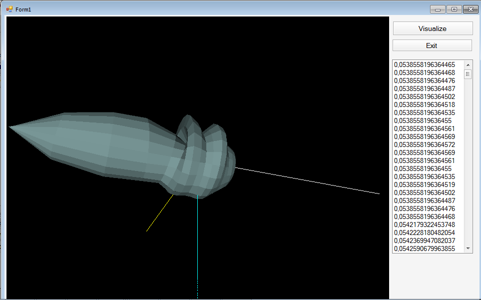
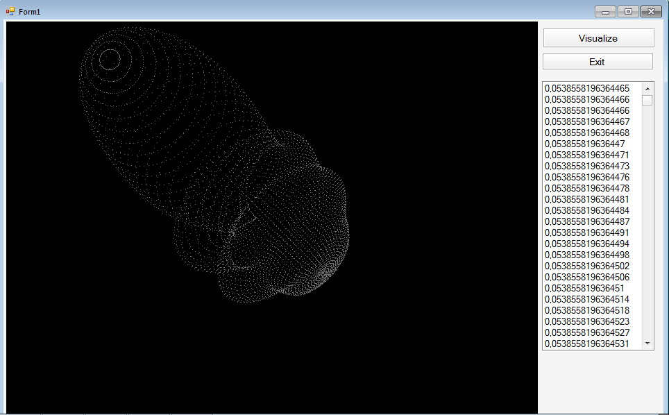
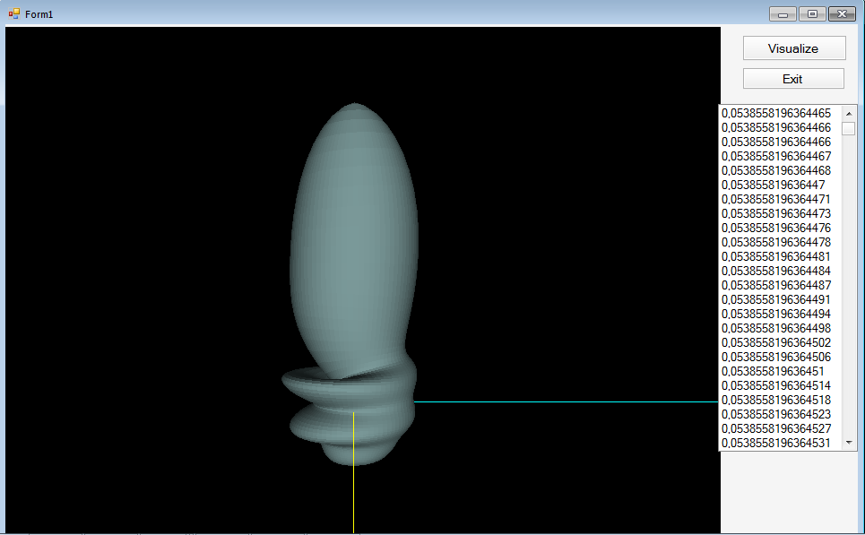
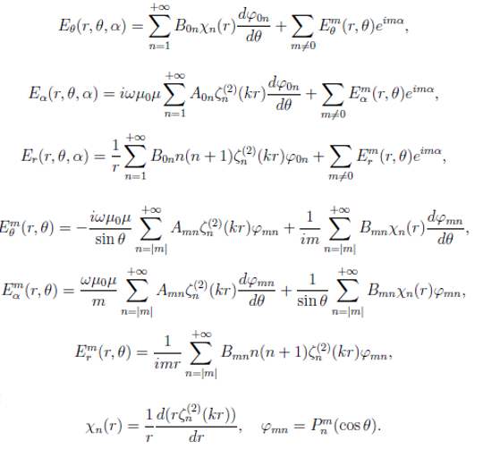
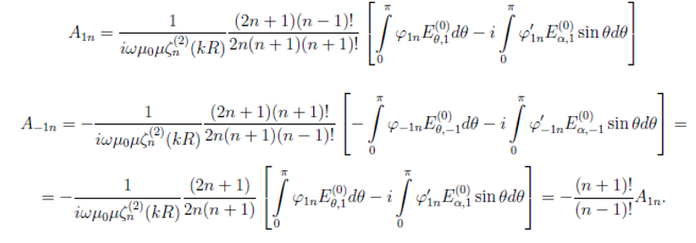
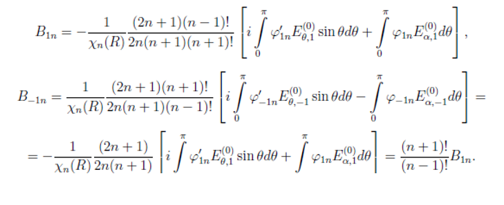
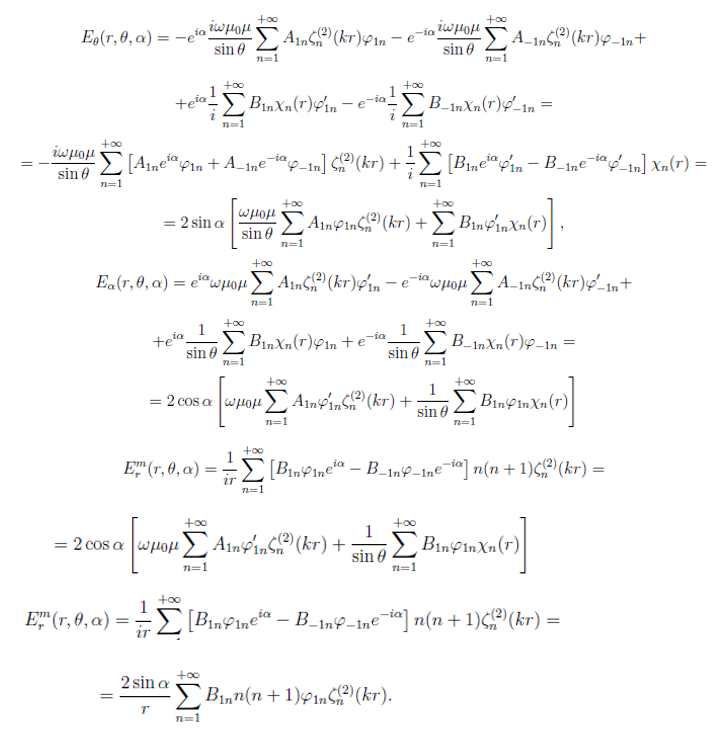

# Body rotation

The Win Form project represents a 3D model of electromagnetic wave diffraction on a sphere. 
The method of numerical solution of the system of Maxwell's equations was used in the work to calculate the diffraction of a plane wave on a sphere.

### Used technologies

OpenGL 2.1.0.12 and Tao Framework library

### The view of a 3D diffraction model

### The solution

The components of the electric intensity vector:

The coefficients of the series of the field diffracted from the sphere:

Other coefficients:

The components of the vector E:

